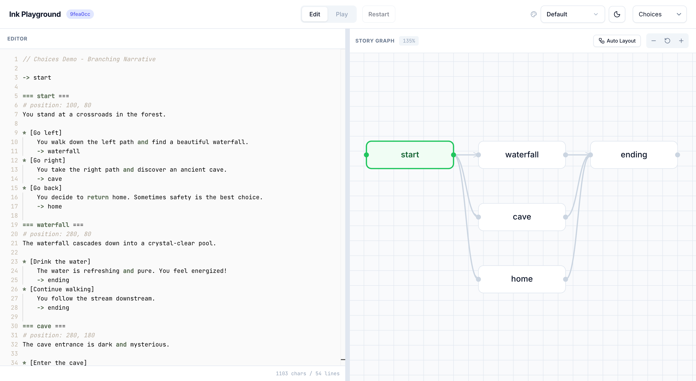
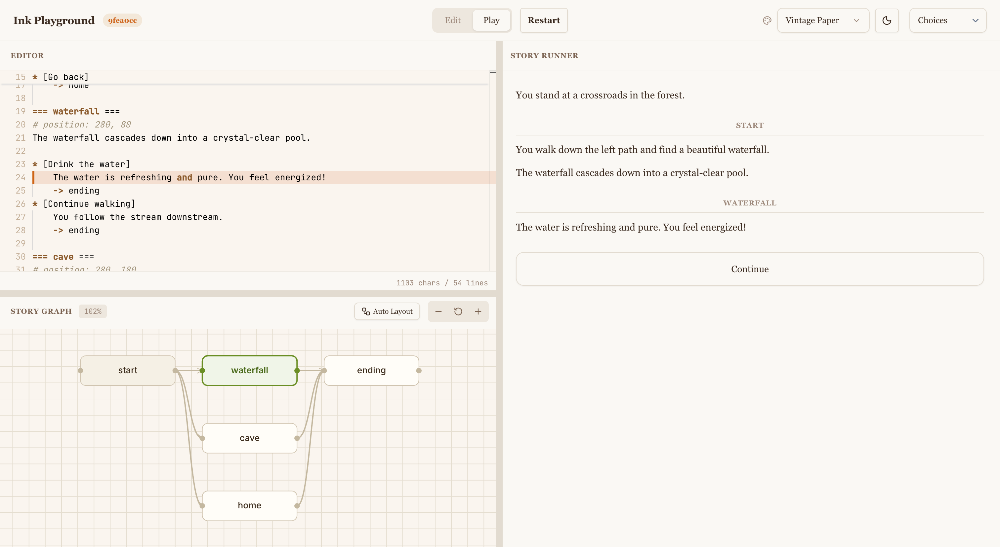

<div align="center">

# 🪶 Ink Playground

**A no-setup browser sandbox for [Ink](https://www.inklestudios.com/ink/) — inkle's narrative scripting language for branching, stateful interactive fiction.**

Type Ink on the left, watch the story (and its variables) come alive on the right. That's it. That's the playground.

[**▶ Try it live → ink.wickend.dev**](https://ink.wickend.dev)


**Edit mode** — Monaco editor on the left, live story graph on the right.



**Play mode** — story runner with choices, graph highlights the current knot.



</div>

---

## Why?

Ink is a tiny, beautiful language for writing branching stories — but the official tooling expects you to set up Unity or a C# project first. I just wanted a **blank page, a Run button, and instant feedback**.

So this is that. Open the page, write `=== story ===`, hit Cmd+Enter, click choices.

## What's inside

- 🖋  **Monaco editor** with Ink syntax highlighting
- 🗺  **Story graph** — every knot as a node, drawn live as you type, with the current knot highlighted while you play
- ▶️  **Live story runtime** powered by [`inkjs`](https://github.com/y-lohse/inkjs) — the same engine inkle ships
- 🌓  **Light & dark theme** with a built-in theme picker (`Default`, plus a few presets)
- 📚  **Six bundled examples** that ramp from `Hello World` → knots → variables → advanced flow control

## Try it locally

```bash
pnpm install
pnpm dev
# → http://localhost:5173
```

Then:

1. Pick an example (or start from scratch)
2. Edit the script
3. **Cmd+Enter** to run — make choices, watch state update

## A taste

```ink
=== bar ===
The neon hums. The bartender raises an eyebrow.
+ [Order whiskey]   -> whiskey
+ [Just water]      -> water
+ [Walk back out]   -> END

=== whiskey ===
~ tab += 12
"Rough day?" he asks. You don't answer.
-> bar
```

Drop that in, run it, and you've already got branching, state, and a loop.

## Stack

`React 19` · `TypeScript` · `Vite 7` · `Tailwind 4` · `Monaco` · `inkjs`

## Status

A weekend hack that I keep tinkering with. Stable for actual writing, but expect the UI to shift around. Issues and PRs welcome.

## Credits & resources

Standing on the shoulders of —

- [**inkle**](https://www.inklestudios.com/ink/) for Ink itself and its [official documentation](https://github.com/inkle/ink/blob/master/Documentation/WritingWithInk.md)
- [**inkjs**](https://github.com/y-lohse/inkjs) by Yannick Lohse — the JS port that makes this possible
- [Monaco Editor](https://microsoft.github.io/monaco-editor/)

## License

[MIT](./LICENSE) © [Wickes1](https://github.com/wickes1) — do whatever, just don't blame me.
